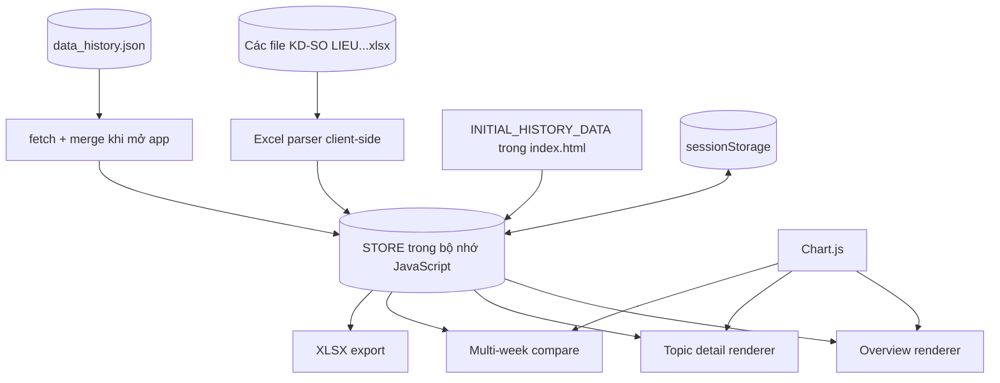
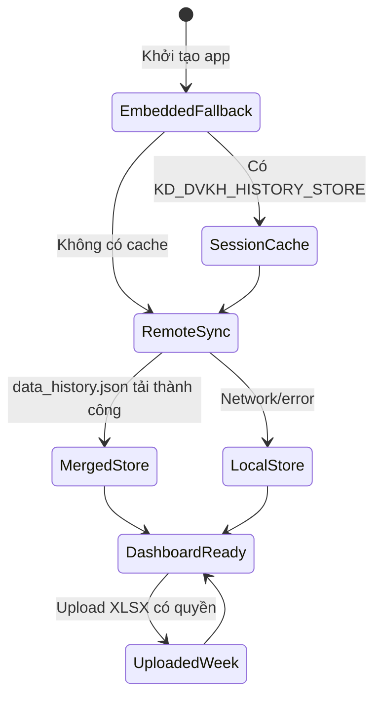

# Kiến trúc dự án Dashboard KD-DVKH PC Đồng Nai

Tài liệu này mô tả workflow và schema thực tế của bản phát hành hiện tại. Ứng dụng là một **single-page app HTML/CSS/JavaScript**, chạy tĩnh trên GitHub Pages hoặc mở trực tiếp bằng trình duyệt.

## 1. Workflow tổng thể

```mermaid
flowchart TD
    A[File Excel tuần mới] --> B{Người dùng đã đăng nhập?}
    B -- Không --> C[Hiển thị modal JWT]
    B -- Có --> D{Role = admin hoặc deputy_manager?}
    D -- Không --> E[Chỉ xem dashboard / so sánh / xuất báo cáo]
    D -- Có --> F[Chọn và upload .xlsx]
    F --> G[SheetJS đọc workbook ở client]
    G --> H[Chuẩn hóa tên đơn vị, tìm sheet và header]
    H --> I[buildTopicsFromWorkbook()]
    I --> J[enrichTopics(): assessment + recommendation]
    J --> K["STORE[weekKey] = weeklyReport"]
    K --> L[sessionStorage: KD_DVKH_HISTORY_STORE]
    L --> M[Render lại selector, overview, topic, chart]

    N[Mở index.html] --> O[Đọc sessionStorage]
    O --> P{Có cache?}
    P -- Có --> Q[Dùng cache tạm thời]
    P -- Không --> R[Dùng INITIAL_HISTORY_DATA nhúng trong HTML]
    Q --> S[fetch data_history.json?t=timestamp]
    R --> S
    S --> T{Tải thành công?}
    T -- Có --> U[Merge từng tuần vào STORE]
    T -- Không --> V[Giữ dữ liệu local/fallback]
    U --> W[renderWeekSelector + renderApp]
    V --> W
```

### Luồng người dùng sau khi đăng nhập

```mermaid
flowchart LR
    Login[Nhập username/password/role] --> Token[createJwtToken()]
    Token --> Session[sessionStorage.KD_JWT_TOKEN]
    Session --> Verify[verifyJwtToken()]
    Verify -->|Hợp lệ, chưa hết hạn| App[Hiển thị ứng dụng]
    Verify -->|Không hợp lệ/hết hạn| Modal[Hiển thị login modal]
    App --> Overview[Tổng quan]
    App --> Topic[Chi tiết 12 chuyên đề]
    App --> Compare[So sánh nhiều tuần]
    App --> Export[Xuất Excel/JSON]
```

> Lưu ý bảo mật: JWT hiện tại là mô phỏng phía client, khóa ký nằm trong mã JavaScript và mật khẩu demo được khai báo trong `index.html`. Cơ chế này phù hợp demo/offline, không phải xác thực production.

## 2. Các thành phần và luồng dữ liệu



## 3. Schema lưu trữ lịch sử tuần

`data_history.json` là một object, trong đó key là mã hiển thị như `Tuần 38`.

```json
{
  "<weekKey>": {
    "order": ["<topicId>"],
    "topics": {
      "<topicId>": { "...": "topic payload" }
    },
    "failed": [],
    "period": "Tuần 38/2026 (14/09 - 18/09/2026)"
  }
}
```

### WeeklyReport

| Trường | Kiểu | Ý nghĩa |
|---|---|---|
| `order` | `string[]` | Thứ tự hiển thị chuyên đề |
| `topics` | `object<TopicId, Topic>` | Dữ liệu 12 chuyên đề |
| `failed` | `string[]` | Sheet/chuyên đề không đọc được khi import |
| `period` | `string` | Nhãn kỳ báo cáo |

### Topic chung

```json
{
  "nav": "Tên ngắn trên menu",
  "title": "Tên đầy đủ chuyên đề",
  "unit_label": "Điện lực hoặc Ngày",
  "metric_label": "Tên chỉ tiêu",
  "target_desc": "Mô tả ngưỡng/chỉ tiêu",
  "type": "ranked | incident | trend",
  "assessment": "Nhận định tự sinh",
  "recommendation": ["Khuyến nghị 1", "Khuyến nghị 2"]
}
```

## 4. Schema chi tiết theo loại chuyên đề

### RankedTopic

Dùng cho: `4THUTD`, `41NONSNN`, `5NLMT`, `6THAYDK`, `7DOXA`, `8TRUYTHU`, `9KTSDĐ`, `9DUBAOPHUTAI`.

```json
{
  "type": "ranked",
  "rows": [{ "unit": "Tên điện lực", "value": 99.5 }],
  "top3": [{ "unit": "Tên điện lực", "value": 100 }],
  "bottom3": [{ "unit": "Tên điện lực", "value": 80 }],
  "dat_count": 21,
  "total": 22,
  "value_suffix": "%",
  "higher_is_better": true
}
```

Các trường mở rộng theo chuyên đề:

| Topic ID | Trường dòng bổ sung |
|---|---|
| `4THUTD` | `target`, `status` |
| `41NONSNN` | `hd` (số ngày) |
| `5NLMT` | `total_cases`, `done` |
| `7DOXA` | `khaithac`, `status_doxa`, `status_khaithac` |
| `8TRUYTHU` | `theft_rows` ở cấp topic |
| `9DUBAOPHUTAI` | `sai_so`, `dtp_tong` |

### IncidentTopic

Dùng cho `3HAILONGKH`, `1CRM`, `2MATDIENTBACC`.

```json
{
  "type": "incident",
  "total_incidents": 7,
  "rows": [{ "unit": "Tên điện lực", "noidung": "Mô tả phản ánh" }]
}
```

Biến thể:

- `1CRM`: dùng `counts: [[unit, count]]`, không bắt buộc `rows`.
- `3HAILONGKH`: dòng gồm `unit`, `noidung`.
- `2MATDIENTBACC`: dòng gồm `unit`, `so_tram`, `tong_lan`, và thêm `total_tram` ở cấp topic.

### TrendTopic

Dùng cho `10DIENNHANTUAN`.

```json
{
  "type": "trend",
  "rows": [{
    "ngay": "Thứ 2",
    "tuan36": 52949715,
    "tuan37": 63164230,
    "sosanh": 119.3
  }],
  "tong36": 369341691,
  "tong37": 434749998,
  "tongsosanh": 117.7
}
```

## 5. Schema xác thực và phân quyền

### User profile

```json
{
  "username": "admin",
  "name": "Quản trị viên",
  "title": "Admin Hệ thống",
  "role": "admin"
}
```

Các role hiện có: `leadership`, `manager`, `deputy_manager`, `employee`, `admin`.

### JWT payload

```json
{
  "sub": "admin",
  "name": "Quản trị viên",
  "title": "Admin Hệ thống",
  "role": "admin",
  "exp": 1780000000000
}
```

| Quyền | `leadership` | `manager` | `deputy_manager` | `employee` | `admin` |
|---|---:|---:|---:|---:|---:|
| Xem dashboard | Có | Có | Có | Có | Có |
| So sánh tuần | Có | Có | Có | Có | Có |
| Xuất Excel/JSON | Có | Có | Có | Có | Có |
| Upload Excel | Không | Không | Có | Không | Có |

## 6. Mapping Excel → JSON

```mermaid
flowchart LR
    W[Workbook XLSX] --> S[Worksheet]
    S --> H[Detect header bằng keyword]
    H --> U[matchUnit() chuẩn hóa 22 điện lực]
    U --> C[Đọc cột theo cấu hình chuyên đề]
    C --> R[buildRanked / incident / trend object]
    R --> E[enrichTopics]
    E --> J[WeeklyReport JSON]
```

Các bước parser chính trong `index.html`:

1. `XLSX.read()` đọc workbook ở trình duyệt.
2. `findSheet()`, `findHeaderRow()`, `collectUnitRows()` tìm vùng dữ liệu.
3. `matchUnit()` quy đổi tên về 22 Điện lực chuẩn.
4. `buildTopicsFromWorkbook()` tạo `WeeklyReport`.
5. `enrichTopics()` bổ sung nhận định, top/bottom và khuyến nghị.

## 7. Trạng thái và nguồn dữ liệu



`sessionStorage` chỉ tồn tại trong phiên/trình duyệt hiện tại; việc phát hành dữ liệu dùng file tĩnh `data_history.json` và deploy lại lên hosting.
